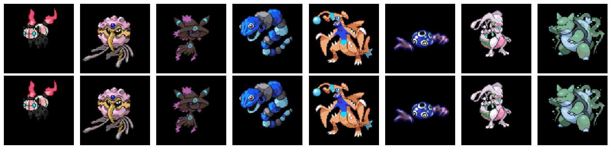

# Pokemon-fusion-representation-learning
This project was completed for the CS 360 final competition and focuses on representation learning using deep autoencoders / variational autoencoders on Pokémon Fusion images.

The goal of the project is to learn a compact bottleneck representation of images that performs well on multiple downstream tasks, including:

- Image reconstruction
- Linear probing on the learned representation
- Latent space sampling

The model was trained on a dataset of Pokémon fusion images and optimized under bottleneck size and model efficiency constraints.

# Project Overview

Deep representation learning aims to learn compressed features that retain meaningful information about the input data.  

In this project, we train a **Convolutional Variational Autoencoder (ConvVAE)** to encode Pokémon fusion images into a **low-dimensional latent representation**, which can then be used for reconstruction and downstream classification.

### Results
Below are example reconstructions produced by the trained ConvVAE model.

The top row shows the **original** Pokémon fusion images, and the bottom row shows the **reconstructed** outputs from the latent representation.

# Model Architecture

The model is implemented in **PyTorch** and follows a convolutional VAE design.

### Encoder

The encoder progressively downsamples the image while increasing the number of channels:

3 → 112 → 224 → 448 → 448

The encoder outputs the **latent distribution parameters**:

- mean
- log variance

### Decoder

The decoder reconstructs the image from the latent representation using:

- upsampling layers
- convolution layers
- multiple Residual Blocks for refinement

Final output is passed through a Sigmoid layer to produce normalized images.

### Latent Representation

The latent bottleneck is implemented using latent feature maps with channel size: latent_channels = 32

The representation is also used for classification through a linear probing head.

# Training Objective

The training objective combines three components:

### Reconstruction Loss

Mean squared error between input and reconstructed image: MSE(x_recon, x)

### Classification Loss

Cross-entropy loss on the latent representation.

### KL Divergence

Regularization term encouraging the latent distribution to approximate a standard Gaussian.

### Final Loss

log(reconstruction_loss)

log(classification_loss)

β * KL_divergence

This objective encourages the model to learn useful latent representations while maintaining reconstruction quality.

# Dataset

The dataset consists of around **18,000 Pokémon Fusion images**.

Each data sample contains:

- Image tensor
- Pokémon type label

Due to file size constraints, the dataset is **not included in this repository**.
